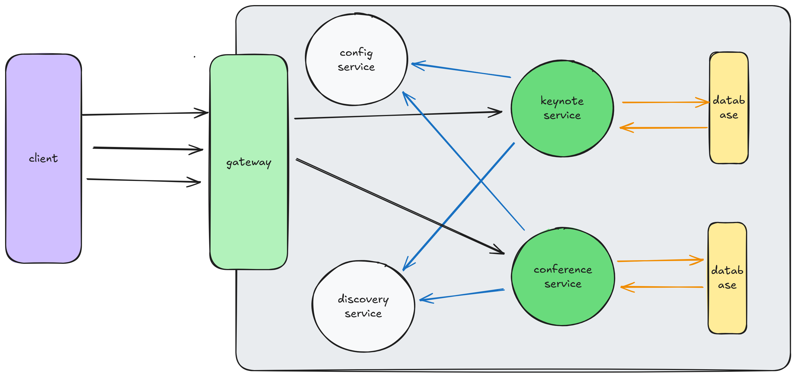

# Conference Management System

A Spring Boot microservices application for managing conferences with keynote speakers.

## Architecture

This project implements a microservices architecture with the following components:

- **Keynote Service** - Manages keynote speakers
- **Conference Service** - Manages conference information  
- **Gateway Service** - API Gateway for routing requests
- **Eureka Discovery Server** - Service discovery (planned)



## Project Structure

```
├── Keynote-service/     # Keynote speakers microservice
├── Conference-service/  # Conference management microservice
├── Gateway-service/     # API Gateway
├── screenshots/         # Project screenshots
└── README.md
```

## Implementation Steps

### 1. Keynote Service

Created using Spring Initializer with the following dependencies:
- Lombok
- Spring Web
- Spring Data JPA
- H2 Database
- REST Repositories
- Config Client

**Implementation:**
- Created `Keynote` entity with fields: firstName, lastName, email, profession
- Created `KeynoteRepo` repository interface
- Seeded initial data using `CommandLineRunner`
- Added REST endpoints via Spring Data REST
- Tested API endpoints in browser
- Added projections for data views


**Endpoints:**
- `GET /keynotes` - List all keynotes
- `POST /keynotes` - Create new keynote
- `GET /keynotes/{id}` - Get keynote by ID

### 2. Conference Service

Created using Spring Initializer with same dependencies as Keynote Service.

**Implementation:**
- Created `Conference` entity with fields: title, date, type, duration, participantNumber, score
- Created `ConferenceRepo` repository interface
- Seeded sample conference data using `CommandLineRunner`
- Added REST endpoints via Spring Data REST
- Added projections for data views
- Tested API endpoints in browser


**Endpoints:**
- `GET /conferences` - List all conferences
- `POST /conferences` - Create new conference
- `GET /conferences/{id}` - Get conference by ID

### 3. API Gateway Service

Created using Spring Initializer with the following dependencies:
- Spring Cloud Gateway (Reactive)
- Config Client
- Actuator
- Eureka Discovery Client

**Implementation:**
- Configured routing to microservices:
  - `/api/keynotes/**` → Keynote Service (port 8080)
  - `/api/conferences/**` → Conference Service (port 8081)
- Gateway runs on port 8888
- Tested routing functionality in browser


## Running the Application

1. **Start Keynote Service:**
   ```bash
   cd Keynote-service
   ./mvnw spring-boot:run
   ```
   Service runs on `http://localhost:8080`

2. **Start Conference Service:**
   ```bash
   cd Conference-service
   ./mvnw spring-boot:run
   ```
   Service runs on `http://localhost:8081`

3. **Start Gateway Service:**
   ```bash
   cd Gateway-service
   ./mvnw spring-boot:run
   ```
   Gateway runs on `http://localhost:8888`

## API Usage

Access all services through the Gateway:

- **Keynotes:** `http://localhost:8888/api/keynotes`
- **Conferences:** `http://localhost:8888/api/conferences`


## Technologies Used

- Spring Boot 3.5.6
- Spring Cloud Gateway
- Spring Data JPA
- Spring Data REST
- H2 Database
- Lombok
- Maven

## Database

Both services use H2 in-memory database for development. Access H2 console:
- Keynote Service: `http://localhost:8080/h2-console`
- Conference Service: `http://localhost:8081/h2-console`


## Screenshots

All project screenshots are available in the `./screenshots` directory:
- Architecture diagram
- H2 database views
- API testing results
- Gateway routing demonstrations
- Service startup logs
